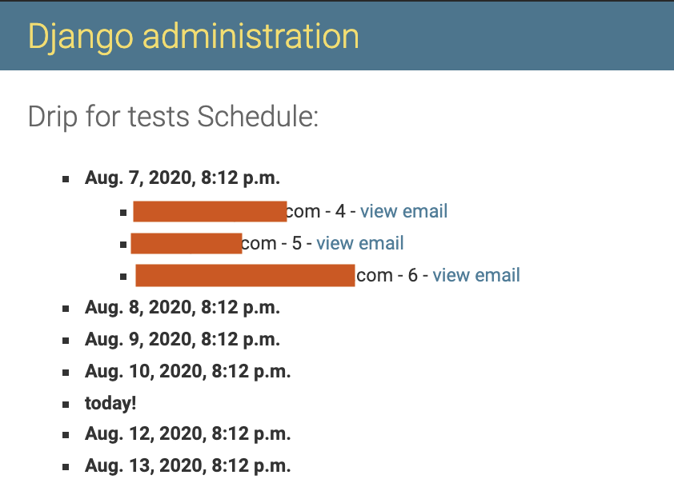

[](https://codeclimate.com/repos/5f0c9d52db4bad011400189e/maintainability)
[](https://codeclimate.com/repos/5f0c9d52db4bad011400189e/test_coverage)

# Django Drip Campaigns

[](https://travis-ci.com/rootstrap/django-drip-campaigns)

Drip campaigns are pre-written sets of emails sent to customers or prospects over time. Django Drips lets you use the admin to manage drip campaign emails using querysets on Django's User model.

This project is a fork of the one written by [Zapier](https://zapier.com/z/qO/).

## Installation:

1. Install django-drip-campaings using pip:

```
pip install django-drip-campaigns
```

2. Add `'drip'` to your `INSTALLED_APPS` list on your settings.

```python
INSTALLED_APPS = [
    'django.contrib.contenttypes',
    'django.contrib.comments',
    'django.contrib.sessions',
    'django.contrib.sites',
    'django.contrib.admin',

    # ...

    'drip',
]
```

3. (Optional) Set `DRIP_FROM_EMAIL = '<your_app_from_email>'` in your settings, where `<your_app_from_email>` is the email account that is going to be shown in the sent emails. Otherwise `EMAIL_HOST_USER` value will be used.

4. Finally, run `python manage.py migrate drip` to set up the necessary database tables.

## Usage

If you haven't, create a superuser with the [django createsuperuser command](https://docs.djangoproject.com/en/3.0/intro/tutorial02/#creating-an-admin-user). Enter with the admin user, and select `Drips` to manage them. You will be able to:

- View the drips.
- Create a new drip.
- Select and delete drips.

### Create Drip

In the django admin, after select `Drips`, you can click on `ADD DRIP +` button to create a new drip. You will see the `add drip` page:


On the `FIELD NAME OF USER` input, when you click on it, you will be able to view:

- The fields of your user's model.
- The fields of your user's model in other models that are related with it.

Please take a look a this example:


Whit this, you can select one or more fields to create useful drips.

### View Timeline

In the django admin, you can select a drip and then click on the `VIEW TIMELINE` button to view the mails expected to be sent with the corresponding receivers:



### Send drips

To send the created and enabled drips, run the command:

```
python manage.py send_drips
```

You can use cron to schedule the drips.
