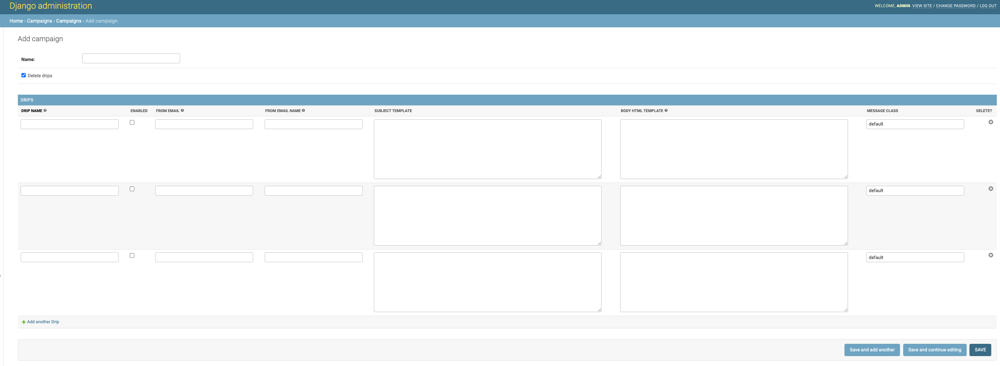

.. _create-campaign:

:orphan:

Create Campaign
===============

The Campaign creation page looks like this:

When you create a campaign, you need to decide if the related drips will be deleted along with the campaign, using the ``Delete drips`` field.

Here you will find an inline creation or edition for ``Drips`` this will not include the ``QUERY SET RULES`` section. It will only allow you to change the mail content in the Drip.

Campaigns will allow you to manage many Drips that need to be related between them.
