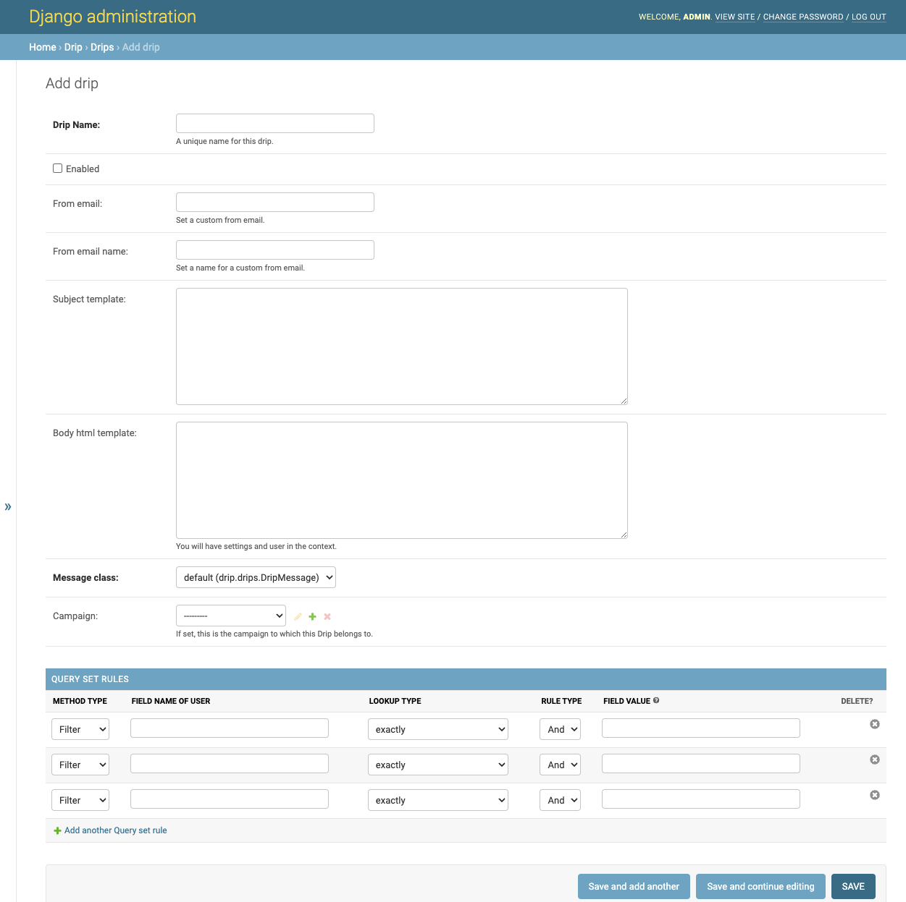
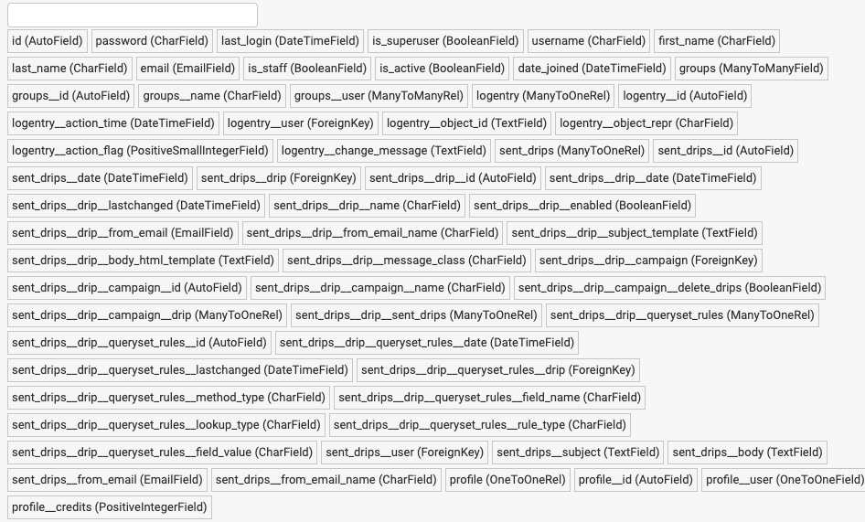

.. _create-drip:

:orphan:

Create Drip
===========

The Drip creation page looks like this:

When you create a drip, you need at least one queryset so the users in it will be the ones that receive the defined email. In the ``METHOD TYPE`` menu you are able to choose to filter or to exclude the users in the defined queryset.  
On the other hand, when you click in the ``FIELD NAME OF USER`` input, you will see the fields of your User model, and the fields of your user model in the models related to it:

In the previous image, for example, `last_login` is the field in the User model, and `groups__user__id` is the user id from the Groups model that is related to it. So you can enter the name of the field or select it from the list that you see when you click on the input.  
After the selection of the field name, you have to choose the type of lookup that you want to do over the field. The possibilities are `exactly`, `exactly (case insensitive)`, `contains`, `contains (case insensitive)`, `greater than`, `greater than or equal to`, `less than`, etc. This lookup type will be done over the user field and the `FIELD VALUE` that you enter.  
The `FIELD VALUE` input can be a string, a number, or a regular expression. The correctness of the queryset rule will depend on the type of the user field, the lookup type, and the field value.

When you enter a user field that has a date type, Django Drip Campaigns allows you to enter a date value in natural language combining the current time and some operation with seconds, hours, days, etc. For example, if you have selected the field `last_login` that has a date type, and you want to create a drip to send emails to the users who logged in exactly one week ago; you can enter:

Finally you have the `rule_type` field this field determines how the queryset will be filtered by that particular rule.
At the moment, all the rules with rule type `And` narrow a queryset and all the rules with rule type `Or` generate different branches for example if you have the following conditions:
`friends__count greater than 3 rule_type AND`, `friends__count less than 5 rule_type AND`, `name equals "john" rule_type OR`, `name equals "joe" rule_type OR`,
will be interpreted as follows
`(name == john) OR (name == joe) OR ((friends__count > 3) AND friends__count < 5))``

.. code-block:: python

    now-1 week

or

.. code-block:: python
    
    now- 1 w

Possible operations and values:

- Add (``+``) or subtract (``-``) dates.
- On the left side of the operation, write the current datetime value: ``now``.
- On the right side of the operation:

  - ``seconds`` or ``s``.
  - ``minutes`` or ``m``.
  - ``hours`` or ``h``.
  - ``days`` or ``d``.
  - ``weeks`` or ``w``.
  - If you enter the number ``1``, you can write ``second``, ``minute``, etc.
  - Don't enter a space between ``now`` and the operation symbol. Optionally you can add (or not) a space around the number value.

Let's see some examples of the date values that you can enter:

- ``now-1 day``
- ``now+ 8days``
- ``now+ 1 h``
- ``now-4hours``
- ``now- 3 weeks``
- ``now-1 weeks``

As you can see, the queryset rules creation is very powerful and for each drip you can add as many as you want.
