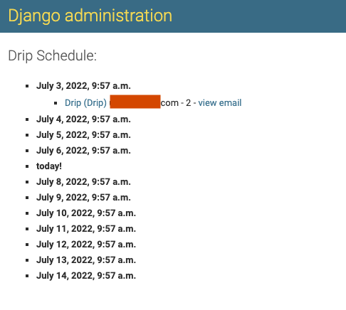

Features
=============

If you haven't, create a superuser with the `Django createsuperuser command <https://docs.djangoproject.com/en/3.0/intro/tutorial02/#creating-an-admin-user>`_. Login with the admin user, and select ``Drips`` to manage them. You will be able to:

- View created drips.
- Create a new drip.
- Select and delete drips.

Now you can also manage campaigns, select ``Campaigns`` to manage them. You will be able to:
- View created campaigns.
- Create a new campaign.
- Select and delete campaign.

Create Campaign
---------------
Click on the ``ADD CAMPAIGNS +`` button to create a new Campaign. In the creation you need to define the email that you want to send, the campaign the Drip belong to and the queryset for the users that will receive it. To see more details, :ref:`click here <create-campaign>`.

View timeline of a Campaign
---------------------------

In the django admin, you can select a campaign and then click on the ``VIEW TIMELINE`` button to view the emails expected to be sent with the corresponding receivers grouped by the Drip and with a link to the email and to the Drip itself:

Create Drip
-----------
Click on the ``ADD DRIP +`` button to create a new Drip. In the creation you need to define the email that you want to send, the campaign the Drip belong to and the queryset for the users that will receive it. To see more details, :ref:`click here <create-drip>`.

View timeline of a Drip
-----------------------

In the django admin, you can select a drip and then click on the ``VIEW TIMELINE`` button to view the emails expected to be sent with the corresponding receivers:

.. image:: ../../images/view_timeline.png
  :width: 400
  :alt: View timeline

Message class
-------------

By default, Django Drip creates and sends messages that are instances of Django’s ``EmailMultiAlternatives`` class.
If you want to customize in any way the message that is created and sent, you can do that by creating a subclass of ``EmailMessage`` and overriding any method that you want to behave differently.
For example:

.. code-block:: python

    from django.core.mail import EmailMessage
    from drip.drips import DripMessage

    class PlainDripEmail(DripMessage):

        @property
        def message(self):
            if not self._message:
                email = EmailMessage(self.subject, self.plain, self.from_email, [self.user.email])
                self._message = email
            return self._message

In that example, ``PlainDripEmail`` overrides the message property of the base ``DripMessage`` class to create a simple
``EmailMessage`` instance instead of an ``EmailMultiAlternatives`` instance.

In order to be able to specify that your custom message class should be used for a drip, you need to configure it in the ``DRIP_MESSAGE_CLASSES`` setting:

.. code-block:: python

    DRIP_MESSAGE_CLASSES = {
        'plain': 'myproj.email.PlainDripEmail',
    }

This will allow you to choose in the admin, for each drip, whether the ``default`` (``DripMessage``) or ``plain`` message class should be used for generating and sending the messages to users.

Send Drips
----------

To send the created and enabled Drips, run the command:

.. code-block:: python

    python manage.py send_drips

You can use cron to schedule the drips.

The Cron Scheduler
------------------

You may want to have an easy way to send drips periodically. It's possible to set a couple of parameters in your settings to do that.
First activate the scheduler by adding the ``DRIP_SCHEDULE_SETTINGS`` dictionary:

.. code-block:: python

    # your settings file
    DRIP_SCHEDULE_SETTINGS = {
        'DRIP_SCHEDULE': True,
    }

After that, choose:

- A day of the week: An integer value between ``0-6``, or a string: ``'mon'``, ``'tue'``, ``'wed'``, ``'thu'``, ``'fri'``, ``'sat'``, ``'sun'``. The name in the settings is ``DRIP_SCHEDULE_DAY_OF_WEEK`` (default is set to ``0``).
- An hour: An integer value between ``0-23``. The name in the settings is ``DRIP_SCHEDULE_HOUR`` (default is set to ``0``).
- A minute: An integer value between ``0-59``. The name in the settings is ``DRIP_SCHEDULE_MINUTE`` (default is set to ``0``).

With those values, a cron scheduler will execute the `send_drips` command every week in the specified day/hour/minute. The scheduler will use the timezone of your ``TIME_ZONE`` parameter in your settings (default is set to ``'UTC'``). For example, if you have:

.. code-block:: python

    DRIP_SCHEDULE_SETTINGS = {
        'DRIP_SCHEDULE': True,
        'DRIP_SCHEDULE_DAY_OF_WEEK': 'mon',
        'DRIP_SCHEDULE_HOUR': 13,
        'DRIP_SCHEDULE_MINUTE': 57,
    }

Then every Monday at 13:57 the ``send_drips`` command will be executed.  
Last but not least, add this line at the end of your main ``urls.py`` file to start the scheduler:

.. code-block:: python

    # your main urls.py file
    ...
    from drip.scheduler.cron_scheduler import cron_send_drips

    ...
    cron_send_drips()

We recommend you to do it there because we know for sure that it's a file that is executed once at the beginning.

Some tips:

- If you want to run the command every day in the week, hour, or minute, just set the corresponding parameter to ``'*'``.
- If you want to run the command more than a day in the week, just set the ``DRIP_SCHEDULE_DAY_OF_WEEK`` to more than one value. For example, if you set that to ``'mon-fri'`` the command will be executed from Monday to Friday.

Celery integration
------------------

IMPORTANT: We use Celery 5.2.2 that supports Django 1.11 LTS or newer versions.

If you need to use celery it can be configured in the same way you just need to add the following key ``SCHEDULER`` setted as ``"CELERY"``:

.. code-block:: python

    DRIP_SCHEDULE_SETTINGS = {
        'DRIP_SCHEDULE': True,
        'DRIP_SCHEDULE_DAY_OF_WEEK': 'mon',
        'DRIP_SCHEDULE_HOUR': 13,
        'DRIP_SCHEDULE_MINUTE': 57,
        'SCHEDULER': 'CELERY',
    }

The default value of this key is ``"CRON"``, if you enable ``DRIP_SCHEDULE`` it will work with a Cron by default.

In order to make this happen, the project's ``celery.py`` setup shall invoke the
`autodiscoverttasks <https://docs.celeryproject.org/en/latest/reference/celery.html#celery.Celery.autodiscover_tasks>`_
function. This task is scheduled with a simple
`Celery beat configuration <https://docs.celeryproject.org/en/latest/userguide/periodic-tasks.html#entries>`_.

Unsubscribe users from emails
-----------------------------

If you need to unsubscribe users from the emails please add the following key ``DRIP_UNSUBSCRIBE_USERS``set as ``True`` in the settings file.

We support unsubscribing from ``Drip``, ``Campaign``, and also all emails (all emails sent by this library).

To see more details about changes in Drip create, :ref:`click here <create-drip>`.

Another config is needed here, please add drip urls:

.. code-block:: python

    urlpatterns = [
        ...,
        path('drip_unsubscribe/', include('drip.urls'))
    ]

This configuration will enable 3 views (one for every type of unsubscription) with some dump HTML.

.. code-block:: python

    class UnsubscribeDripView(TemplateView):
        template_name = "unsubscribe_drip.html"
        invalid_template_name = "unsubscribe_drip_invalid.html"
        success_template_name = "unsubscribe_drip_success.html"
        ...
    
    class UnsubscribeCampaignView(TemplateView):
        template_name = "unsubscribe_campaign.html"
        invalid_template_name = "unsubscribe_campaign_invalid.html"
        success_template_name = "unsubscribe_campaign_success.html"
        ...
    
    class UnsubscribeView(TemplateView):
        template_name = "unsubscribe_general.html"
        invalid_template_name = "unsubscribe_general_invalid.html"
        success_template_name = "unsubscribe_general_success.html"
        ...

These dump views will be useful for development, if you wish to customize the HTML, please follow this example:

.. code-block:: python

    from drip.views import UnsubscribeView

    class CustomUnsubscribeView(UnsubscribeView):
        template_name = "custom_template.html"
        invalid_template_name = "invalid_custom_template.html"
        success_template_name = "sucess_custom_template.html"

And then instead of adding the drip urls add the views you customize as the following:

.. code-block:: python

    from django.urls import re_path

    urlpatterns = [
        ...,
        re_path(
            r"^app/(?P<uidb64>\w+)/(?P<token>[\w-]+)/$",
            CustomUnsubscribeView.as_view(),
            name="unsubscribe_app",
        ),
    ]

Take a look in ``drip.urls`` file to understand how urls are build for all 3 views.
IMPORTANT: Please keep the views ``name`` with the same values.
